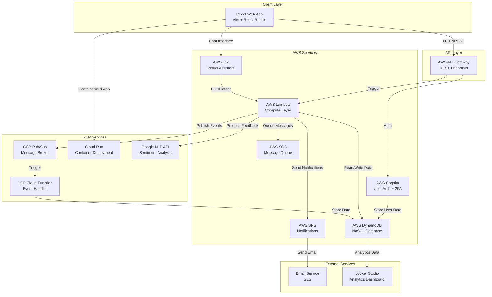

# System Architecture Overview

## High-Level Architecture Diagram



## Detailed Service Breakdown

### Frontend Application
```
React Web App (Port 5173 Dev / 80 Prod)
├── Pages
│   ├── Home - Property listing
│   ├── SignUp/SignIn - Authentication
│   ├── RoomDetails - Property details & booking
│   ├── Dashboard - User/Admin panel
│   └── CustomerConcerns - Support tickets
├── State Management (Zustand)
│   ├── User authentication state
│   └── Reservation data
├── HTTP Client (Axios)
│   └── API Gateway integration
└── Styling (Tailwind CSS)
```

### AWS Services Interaction

```
┌─────────────────────────────────────────────────────┐
│               AWS Services Layer                     │
├─────────────────────────────────────────────────────┤
│                                                     │
│  1. COGNITO (Authentication)                       │
│     ├─ User registration & verification           │
│     ├─ JWT token generation                       │
│     └─ 2FA with security questions                │
│                                                     │
│  2. LAMBDA (Compute - 18 Functions)               │
│     ├─ User management handlers                    │
│     ├─ Room CRUD operations                        │
│     ├─ Reservation processing                      │
│     ├─ Feedback handling                           │
│     └─ Cross-service orchestration                 │
│                                                     │
│  3. DYNAMODB (Database)                           │
│     ├─ Users table                                 │
│     ├─ Rooms table                                 │
│     ├─ Reservations table                          │
│     ├─ Feedback table                              │
│     └─ Messages table                              │
│                                                     │
│  4. API GATEWAY (REST Interface)                   │
│     ├─ /auth/* - Authentication endpoints         │
│     ├─ /rooms/* - Room operations                  │
│     ├─ /reservations/* - Booking endpoints        │
│     ├─ /feedback/* - Review endpoints             │
│     └─ /messages/* - Messaging endpoints          │
│                                                     │
│  5. SNS/SQS (Messaging)                            │
│     ├─ SNS: Email notifications                    │
│     └─ SQS: Async booking requests                │
│                                                     │
│  6. LEX (Conversational AI)                        │
│     ├─ Intent recognition                         │
│     ├─ Natural language processing                │
│     └─ Lambda fulfillment                         │
│                                                     │
└─────────────────────────────────────────────────────┘
```

### GCP Services Interaction

```
┌─────────────────────────────────────────────────────┐
│             GCP Services Layer                       │
├─────────────────────────────────────────────────────┤
│                                                     │
│  1. PUB/SUB (Message Broker)                       │
│     ├─ Topics for different event types            │
│     └─ Async message distribution                  │
│                                                     │
│  2. CLOUD FUNCTIONS (Event Handlers)               │
│     ├─ Pub/Sub message processor                   │
│     └─ AWS Lambda trigger bridge                   │
│                                                     │
│  3. CLOUD RUN (Container Deployment)               │
│     ├─ Containerized React app                     │
│     ├─ Auto-scaling                                │
│     └─ HTTPS endpoint                              │
│                                                     │
│  4. ARTIFACT REGISTRY (Image Storage)              │
│     ├─ Docker image versioning                     │
│     └─ Build artifact storage                      │
│                                                     │
│  5. CLOUD BUILD (CI/CD Pipeline)                   │
│     ├─ Automated testing                           │
│     ├─ Docker image building                       │
│     └─ Deployment automation                       │
│                                                     │
│  6. NLP API (Sentiment Analysis)                   │
│     ├─ Feedback analysis                           │
│     ├─ Sentiment scoring                           │
│     └─ Intent extraction                           │
│                                                     │
└─────────────────────────────────────────────────────┘
```

## Data Flow Architecture

### Request-Response Flow (Synchronous)

```
Client Browser
    ↓
React App
    ↓
Axios HTTP Client
    ↓
AWS API Gateway
    ↓
Lambda Function
    ├─→ DynamoDB (Read/Write)
    ├─→ AWS Cognito (Auth)
    └─→ Validate & Process
    ↓
Response JSON
    ↓
Zustand State Update
    ↓
Component Re-render
```

### Event-Driven Flow (Asynchronous)

```
Lambda Function
    ↓
GCP Pub/Sub Topic
    ↓
GCP Cloud Function
    ↓
AWS Lambda (via trigger)
    ↓
DynamoDB
    ↓
Looker Studio (Analytics)
```

## Technology Stack by Layer

### Frontend Layer
- **Runtime**: Node.js 18
- **Framework**: React 18.2
- **Bundler**: Vite 5
- **Routing**: React Router v6
- **State Management**: Zustand
- **Styling**: Tailwind CSS + Shadcn UI
- **HTTP Client**: Axios
- **Form Validation**: React Hook Form + Zod

### Backend Layer
- **Compute**: AWS Lambda (Python)
- **Authentication**: AWS Cognito
- **Database**: AWS DynamoDB (NoSQL)
- **API Gateway**: AWS API Gateway (REST)
- **Messaging**: AWS SNS, SQS, GCP Pub/Sub
- **AI/ML**: AWS Lex, Google NLP API

### Deployment Layer
- **Containerization**: Docker
- **Container Registry**: GCP Artifact Registry
- **Web Server**: Nginx (reverse proxy)
- **Platform**: Google Cloud Run
- **CI/CD**: Google Cloud Build
- **IaC**: Terraform

## Key Architectural Decisions

### 1. **Why Serverless?**
- **Scalability**: Auto-scaling based on demand
- **Cost**: Pay only for compute time used
- **Ops**: Reduced operational overhead
- **Flexibility**: Mix and match services

### 2. **Why Both AWS and GCP?**
- **AWS**: Industry-standard auth, compute, and database services
- **GCP**: Superior NLP, Pub/Sub, and analytics capabilities
- **Best of Both**: Leverage each platform's strengths

### 3. **Why DynamoDB for Everything?**
- **Scalability**: Handles millions of requests
- **Consistency**: Eventual consistency with fast writes
- **Cost**: Predictable pricing model
- **Integration**: Native AWS service

### 4. **Why Pub/Sub for Messaging?**
- **Decoupling**: Services don't need to know about each other
- **Reliability**: Guaranteed message delivery
- **Scalability**: Handles high throughput
- **Ordering**: Topic-based message ordering

### 5. **Why Cloud Run for Frontend?**
- **Containerization**: Reproducible deployments
- **Scalability**: Auto-scale based on traffic
- **CI/CD**: Google Cloud Build integration
- **Cost-effective**: Pay per request

## Deployment Architecture

```
GitHub Repository
    ↓
Google Cloud Build (Trigger on push)
    ├─→ Run tests
    ├─→ Build Docker image
    │   ├─ Node.js 18 Alpine
    │   ├─ npm install & build
    │   ├─ Production Nginx serve
    │   └─ Multi-stage optimization
    ├─→ Push to Artifact Registry
    └─→ Deploy to Cloud Run
        ├─ Auto-scale instances
        ├─ HTTPS enabled
        └─ Rolling deployment
```

## Security Architecture

```
User Request
    ↓
API Gateway (API Key validation)
    ↓
Cognito (JWT verification)
    ↓
Lambda (Request validation)
    ├─ Input sanitization
    ├─ Authorization check
    └─ Role-based access
    ↓
DynamoDB (Secure connection)
```

## Performance Considerations

| Component | Optimization |
|-----------|---------------|
| **Lambda** | Cold start mitigation via provisioned concurrency |
| **DynamoDB** | On-demand billing for variable traffic |
| **Frontend** | Vite bundling, code splitting, lazy loading |
| **Nginx** | Gzip compression, caching headers |
| **Cloud Run** | Container image optimization |

---

See related flows:
- [Authentication Flow](./02-authentication-flow.md)
- [Data Flow Architecture](./08-data-flow-architecture.md)
