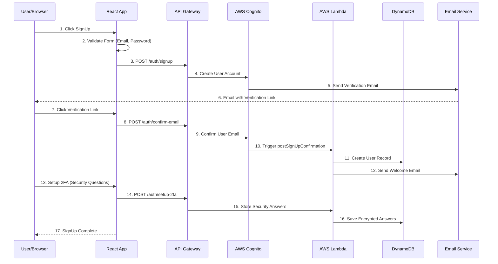
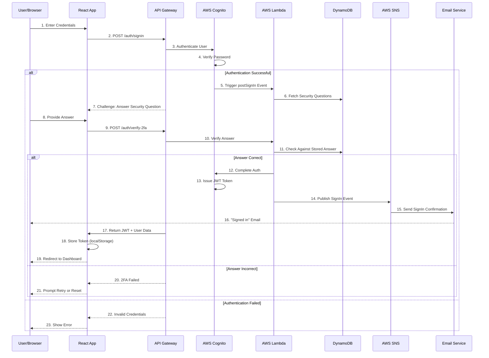
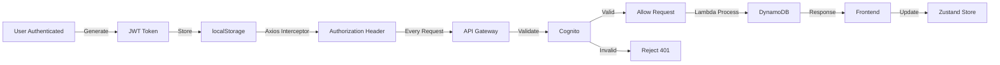

# Authentication & User Management Flow

## Signup Flow (with 2FA)



## Login Flow (with 2FA Verification)



## Signup Flow - Detailed Steps

### Step 1: Email Registration
```
User Input:
├─ Email address
├─ Password (with strength validation)
├─ Full name
└─ User type (Guest/Customer/Owner)

Validation:
├─ Email format valid
├─ Password >= 8 chars, has upper, lower, number, special
├─ Email not already registered
└─ Terms & conditions accepted
```

### Step 2: Cognito User Creation
```
AWS Cognito:
├─ Create new user
├─ Set temporary password
├─ Send verification email
├─ Enable MFA challenge
└─ Store user attributes
```

### Step 3: Email Verification
```
User:
├─ Receives email with verification link
├─ Clicks link
└─ Email confirmed

Lambda postSignUpConfirmation:
├─ Triggered after email confirmation
├─ Creates user profile in DynamoDB
├─ Sets user status to ACTIVE
├─ Sends welcome email
└─ Returns user object
```

### Step 4: Security Question Setup (2FA)
```
User:
├─ Answers 3 security questions
├─ Questions randomly selected from bank
└─ Answers stored encrypted

Stored in DynamoDB:
├─ User ID
├─ Questions array
├─ Encrypted answers (AES-256)
└─ Setup timestamp
```

## Login Flow - Detailed Steps

### Step 1: Initial Authentication
```
Cognito Authentication:
├─ Validate email exists
├─ Verify password hash
├─ Check account status
└─ Generate temporary token
```

### Step 2: 2FA Challenge
```
System:
├─ Generate random security question
├─ Retrieve from user's setup questions
└─ Present to user

Lambda postSignIn:
├─ Triggered after successful password auth
├─ Queries DynamoDB for user's questions
├─ Returns challenge to frontend
└─ Starts session timeout
```

### Step 3: 2FA Verification
```
User:
├─ Receives security question
├─ Provides answer
└─ Submits for verification

Lambda Verification:
├─ Retrieves stored encrypted answer
├─ Decrypts and compares
├─ If match: Issue JWT token
└─ If mismatch: Deny access
```

### Step 4: JWT Token Management
```
Token Generation:
├─ Cognito issues JWT
├─ Contains user ID, roles, permissions
├─ 24-hour expiration
└─ Signed with secret

Frontend Storage:
├─ Store in localStorage
├─ Attached to API requests via Axios interceptor
├─ Auto-refresh on expiry
└─ Clear on logout
```

## JWT Token Flow



## User Roles & Authorization

### 1. Guest User
```
Permissions:
├─ View properties
├─ View room details
├─ Cannot book without signup
└─ Cannot message owner
```

### 2. Regular Customer
```
Permissions:
├─ View all properties
├─ Create reservations
├─ View own bookings
├─ Message property owners
├─ Submit feedback
└─ View booking history
```

### 3. Property Owner
```
Permissions:
├─ Create properties
├─ Update property details
├─ Manage rooms
├─ View bookings
├─ Manage availability
├─ Respond to customer messages
├─ View customer feedback
└─ Access analytics dashboard
```

### 4. Admin
```
Permissions:
├─ Manage all users
├─ Manage all properties
├─ View all bookings
├─ Access customer concerns
├─ View analytics
├─ System configuration
└─ Generate reports
```

## Authorization Check Flow

```
API Request
    ↓
Extract JWT from Authorization Header
    ↓
Validate Token Signature
    ↓
Check Token Expiration
    ↓
Extract User ID & Role
    ↓
Lambda Authorization Logic
    ├─ Is user authenticated? (Has valid JWT)
    ├─ Does user have required role?
    ├─ Does user own this resource?
    └─ Is resource accessible?
    ↓
Deny (401/403) OR Allow (200)
```

## User Record in DynamoDB

```json
{
  "userId": "user_12345",
  "email": "user@example.com",
  "fullName": "John Doe",
  "userType": "CUSTOMER",
  "createdAt": "2024-01-15T10:30:00Z",
  "updatedAt": "2024-01-20T14:45:00Z",
  "status": "ACTIVE",
  "emailVerified": true,
  "mfaEnabled": true,
  "securityQuestions": [
    {
      "questionId": "q1",
      "question": "What is your pet's name?",
      "answerHash": "encrypted_hash_1"
    },
    {
      "questionId": "q2",
      "question": "What city were you born?",
      "answerHash": "encrypted_hash_2"
    },
    {
      "questionId": "q3",
      "question": "What was your first school?",
      "answerHash": "encrypted_hash_3"
    }
  ],
  "roles": ["CUSTOMER"],
  "preferences": {
    "emailNotifications": true,
    "smsNotifications": false
  }
}
```

## Security Best Practices Implemented

### 1. Password Security
- ✅ Minimum 8 characters
- ✅ Requires uppercase, lowercase, number, special character
- ✅ Hashed and salted by Cognito
- ✅ Never transmitted in plain text

### 2. 2FA Implementation
- ✅ Security questions randomized
- ✅ Answers encrypted in database
- ✅ Case-insensitive comparison
- ✅ Rate limiting on failed attempts

### 3. Token Management
- ✅ JWT expiration: 24 hours
- ✅ Signed with secret key
- ✅ Validated on every request
- ✅ Securely stored in localStorage

### 4. Communication Security
- ✅ HTTPS only
- ✅ API Gateway enforces HTTPS
- ✅ No credentials in URL parameters
- ✅ CORS configured

## Error Handling

### Common Scenarios

```
Invalid Email Format
    → Caught at frontend validation
    → User notified immediately
    → Request not sent

Email Already Registered
    → Cognito checks on signup
    → User offered "Forgot Password"
    → Prevents duplicate accounts

Password Too Weak
    → Validation at frontend
    → Clear requirements shown
    → User retries

2FA Answer Incorrect
    → Limited retry attempts (3)
    → Lockout after 3 failures (15 mins)
    → User can reset via email

JWT Token Expired
    → Axios interceptor detects 401
    → Auto-refresh attempted
    → Redirect to login if refresh fails
```

## Signup & Login Endpoints

| Endpoint | Method | Purpose |
|----------|--------|---------|
| `/auth/signup` | POST | User registration |
| `/auth/confirm-email` | POST | Email verification |
| `/auth/signin` | POST | Initiate login |
| `/auth/verify-2fa` | POST | Verify security question |
| `/auth/refresh-token` | POST | Refresh JWT |
| `/auth/logout` | POST | Logout user |
| `/auth/forgot-password` | POST | Reset password |
| `/auth/security-questions` | GET | Fetch security questions |
| `/auth/user-profile` | GET | Get current user info |

---

See related flows:
- [System Architecture](./01-system-architecture.md)
- [Data Flow Architecture](./08-data-flow-architecture.md)
