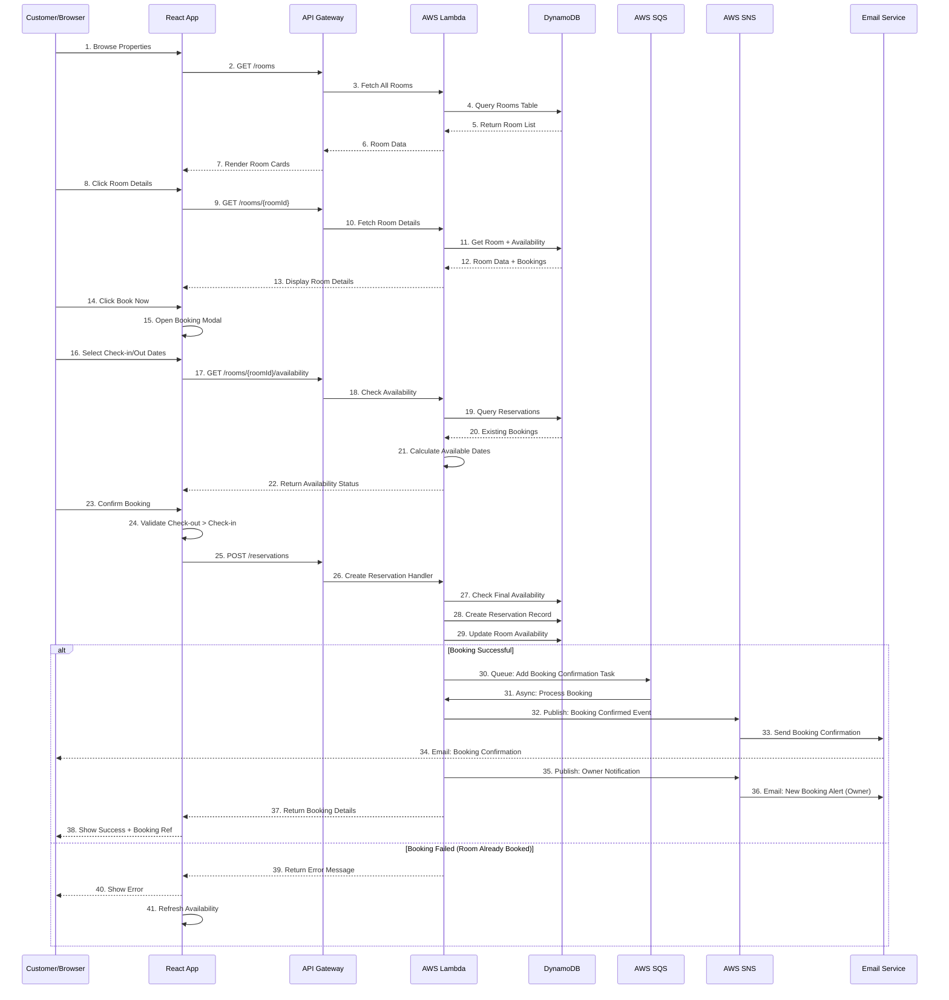
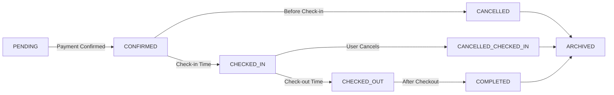
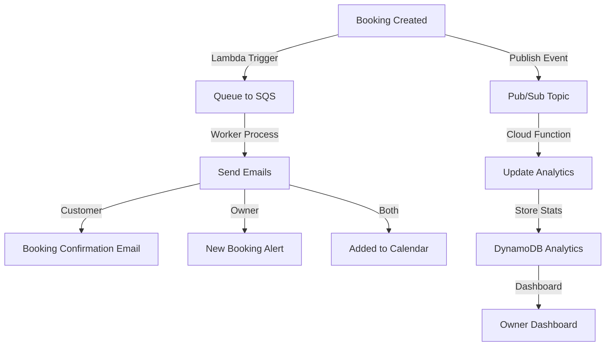
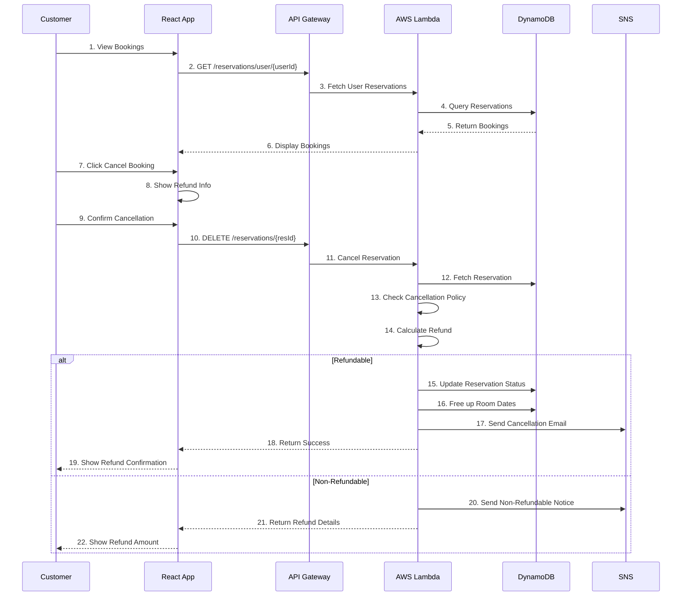

# Booking & Reservation Flow

## Complete Booking Process



## Booking Workflow - Step by Step

### Phase 1: Property Discovery

```
1. User browses homepage
   ├─ See list of available properties
   ├─ Rooms filtered by location/amenities
   └─ Display price per night

2. GET /rooms handler:
   ├─ Query DynamoDB Rooms table
   ├─ Apply filters (location, price range)
   ├─ Return rooms with availability info
   └─ Cache results (1 hour TTL)
```

### Phase 2: Property Details Viewing

```
1. User clicks on room
   ├─ Display full details
   ├─ Show images
   ├─ List amenities
   ├─ Display price breakdown
   └─ Show reviews/ratings

2. GET /rooms/{roomId} handler:
   ├─ Query DynamoDB for room
   ├─ Fetch all reservations for room
   ├─ Calculate booked dates
   ├─ Mark available dates
   └─ Return enhanced room data
```

### Phase 3: Availability Verification

```
1. User selects check-in and check-out dates

2. Frontend validation:
   ├─ Check-out > Check-in
   ├─ Not in the past
   ├─ Calculate night count
   ├─ Calculate total price
   └─ Show price breakdown

3. Backend verification:
   ├─ GET /rooms/{roomId}/availability
   ├─ Lambda queries Reservations table
   ├─ Checks for conflicts
   ├─ Returns boolean availability
   └─ If unavailable, suggest nearby dates
```

### Phase 4: Reservation Creation

```
1. User confirms booking

2. Frontend sends:
   {
     "roomId": "room_123",
     "checkInDate": "2024-02-15",
     "checkOutDate": "2024-02-20",
     "numberOfGuests": 2,
     "totalPrice": 500.00,
     "specialRequests": "High floor preferred"
   }

3. Lambda createReservation:
   ├─ Validate JWT & extract userId
   ├─ Verify room exists
   ├─ Final availability check
   │  └─ Compare against database
   │     (catch race conditions)
   ├─ Calculate total price
   ├─ Create reservation record
   └─ Update room availability index

4. Database transaction:
   ├─ Begin atomic transaction
   ├─ Insert Reservations entry
   ├─ Update Rooms availability
   ├─ Create Booking record
   └─ Commit transaction
```

## Reservation Data Model

```json
{
  "reservationId": "res_abc123",
  "userId": "user_xyz789",
  "roomId": "room_123",
  "roomName": "Deluxe Ocean View Suite",
  "checkInDate": "2024-02-15",
  "checkOutDate": "2024-02-20",
  "numberOfNights": 5,
  "numberOfGuests": 2,
  "guestList": [
    {
      "name": "John Doe",
      "email": "john@example.com"
    },
    {
      "name": "Jane Doe",
      "email": "jane@example.com"
    }
  ],
  "pricePerNight": 100.00,
  "totalPrice": 500.00,
  "taxes": 50.00,
  "fees": 20.00,
  "finalPrice": 570.00,
  "specialRequests": "High floor preferred",
  "status": "CONFIRMED",
  "createdAt": "2024-01-20T10:30:00Z",
  "updatedAt": "2024-01-20T10:30:00Z",
  "paymentStatus": "COMPLETED",
  "cancellationPolicy": "FLEXIBLE",
  "cancellationDeadline": "2024-02-13"
}
```

## Booking Status Flow



## Pricing Calculation

```
Base Rate (per night):          $100.00
Number of Nights:               5 nights
━━━━━━━━━━━━━━━━━━━━━━━━━━━━
Subtotal:                       $500.00
Taxes (10%):                    $50.00
Service Fee (3%):               $15.00
Cleaning Fee:                   $30.00
━━━━━━━━━━━━━━━━━━━━━━━━━━━━
Total Price:                    $595.00

Formula in Lambda:
totalPrice = (basePrice × nights) +
             (taxes × nights × nights) +
             serviceFee +
             cleaningFee
```

## Availability Checking Algorithm

```python
def check_availability(room_id, check_in, check_out):
    # Query all reservations for this room
    reservations = dynamodb.query(
        table='Reservations',
        key_condition='roomId = :roomId',
        expression_attributes={':roomId': room_id}
    )

    # Check for conflicts
    for reservation in reservations:
        if is_overlapping(check_in, check_out,
                         reservation.checkIn,
                         reservation.checkOut):
            return False  # Not available

    return True  # Available

def is_overlapping(start1, end1, start2, end2):
    # No overlap if one ends before other starts
    return not (end1 <= start2 or end2 <= start1)
```

## Concurrent Booking Prevention

```
Race Condition Scenario:
─────────────────────────

Time  Thread A                Thread B
──────────────────────────────────────────────
T1    Read availability ✓
T2    Check dates OK         Read availability ✓
T3    Create reservation     Check dates OK
T4    Commit
T5                           Create reservation
T6                           Commit (CONFLICT!)

Solution: DynamoDB Atomic Transactions
──────────────────────────────────────

Lambda:
1. Begin conditional write
2. Check availability (read)
3. If available, create reservation (write)
4. Atomic commit (all or nothing)
5. If conflict, transaction aborts
6. Return error to client
7. Client retries with new dates

This ensures no overbooking!
```

## Booking Confirmation Workflow



## Email Notifications

### Customer Booking Confirmation Email
```
To: customer@example.com
Subject: Booking Confirmation - Ref #RES-20240120-ABC123

Dear John,

Your reservation is confirmed!

Property: Deluxe Ocean View Suite
Location: Malibu, California
Check-in: February 15, 2024 (3:00 PM)
Check-out: February 20, 2024 (11:00 AM)
Guests: 2

Price Breakdown:
├─ 5 nights × $100.00 = $500.00
├─ Taxes (10%) = $50.00
├─ Service Fee = $15.00
├─ Cleaning Fee = $30.00
└─ TOTAL: $595.00

Booking Reference: RES-20240120-ABC123
Cancellation Deadline: February 13, 2024

[VIEW BOOKING] [CONTACT OWNER]
```

### Owner New Booking Alert
```
To: owner@example.com
Subject: New Booking - Deluxe Ocean View Suite

Hello Jane,

You have a new booking!

Guest: John Doe (john@example.com)
Dates: Feb 15-20, 2024 (5 nights)
Guests: 2
Price: $595.00 (You receive: $535.50)

[VIEW DETAILS] [MESSAGE GUEST]
```

## Cancellation Flow



## API Endpoints for Bookings

| Endpoint | Method | Purpose |
|----------|--------|---------|
| `/rooms` | GET | List all available rooms |
| `/rooms/{roomId}` | GET | Get room details |
| `/rooms/{roomId}/availability` | GET | Check date availability |
| `/reservations` | POST | Create booking |
| `/reservations/{resId}` | GET | Get booking details |
| `/reservations/user/{userId}` | GET | Get user's bookings |
| `/reservations/{resId}` | PUT | Update booking |
| `/reservations/{resId}` | DELETE | Cancel booking |
| `/reservations/{resId}/history` | GET | Get booking history |

---

See related flows:
- [System Architecture](./01-system-architecture.md)
- [Messaging Flow](./04-messaging-flow.md)
