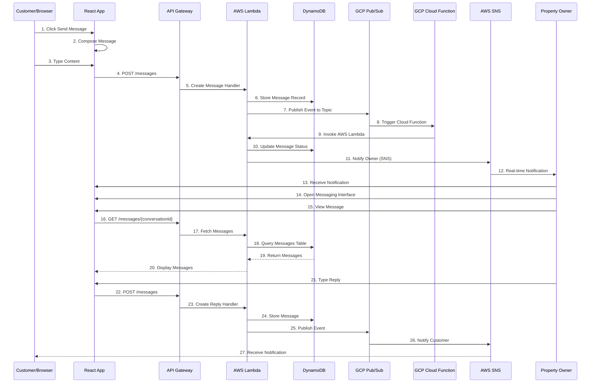
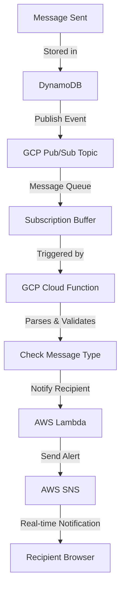
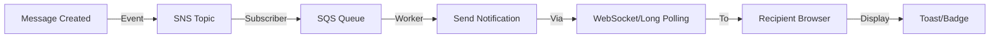

# Messaging System Flow

## Cross-Cloud Messaging Architecture

The messaging system enables real-time communication between customers and property owners using GCP Pub/Sub as the message broker and AWS Lambda for processing.



## Message Flow Architecture

```
┌────────────────────────────────────────────────────────────┐
│                  AWS Services                              │
├────────────────────────────────────────────────────────────┤
│                                                            │
│  Customer/Owner          API Gateway                      │
│       ↓                       ↓                            │
│   Browser  ────────────  Lambda Function                  │
│                             ├─ Validate Message            │
│                             ├─ Store in DynamoDB          │
│                             ├─ Publish to Pub/Sub         │
│                             └─ Return Response            │
│                                                            │
│                          ↓                                 │
│                       SNS Topic                            │
│                     (Send notification)                    │
│                                                            │
│                          ↓                                 │
│                    Email/SMS Service                      │
│                                                            │
└────────────────────────────────────────────────────────────┘

┌────────────────────────────────────────────────────────────┐
│                  GCP Services                              │
├────────────────────────────────────────────────────────────┤
│                                                            │
│  Pub/Sub Topic                                            │
│  (Message Buffer)                                         │
│       ↓                                                    │
│  Cloud Function                                           │
│  (Event Processor)                                        │
│       ├─ Deserialize message                              │
│       ├─ Validate data                                    │
│       └─ Invoke AWS Lambda                                │
│                                                            │
└────────────────────────────────────────────────────────────┘

DynamoDB (Centralized Data)
├─ Messages table
├─ Conversations table
└─ Message history
```

## Message Data Model

```json
{
  "messageId": "msg_xyz789",
  "conversationId": "conv_abc123",
  "senderId": "user_sender123",
  "senderType": "CUSTOMER",
  "senderName": "John Doe",
  "receiverId": "user_owner456",
  "receiverType": "OWNER",
  "receiverName": "Jane Smith",
  "roomId": "room_123",
  "content": "Hi, do you allow late checkout?",
  "type": "TEXT",
  "attachments": [],
  "createdAt": "2024-01-20T10:30:00Z",
  "readAt": null,
  "readBy": [],
  "status": "DELIVERED",
  "priority": "NORMAL",
  "metadata": {
    "relatedBookingId": "res_abc123",
    "source": "WEBAPP"
  }
}
```

## Conversation Model

```json
{
  "conversationId": "conv_abc123",
  "participants": [
    {
      "userId": "user_sender123",
      "name": "John Doe",
      "type": "CUSTOMER"
    },
    {
      "userId": "user_owner456",
      "name": "Jane Smith",
      "type": "OWNER"
    }
  ],
  "roomId": "room_123",
  "roomName": "Deluxe Ocean View Suite",
  "bookingId": "res_abc123",
  "createdAt": "2024-01-20T10:00:00Z",
  "lastMessageAt": "2024-01-20T10:30:00Z",
  "messageCount": 5,
  "unreadCount": 2,
  "status": "ACTIVE",
  "archivedAt": null
}
```

## Message Publishing Flow



## GCP Pub/Sub Integration

### Topic Structure

```
Topics:
├─ vacation-home-messages
│  └─ Subscription: messages-processor
│     └─ Triggers: Cloud Function
│
├─ customer-concerns
│  └─ Subscription: concerns-processor
│     └─ Triggers: Lambda (via Cloud Function)
│
└─ booking-events
   └─ Subscription: booking-processor
      └─ Triggers: Analytics Lambda
```

### Message Publishing Code (Lambda)

```python
from google.cloud import pubsub_v1

def publish_message_event(message_data):
    """Publish message to Pub/Sub"""
    publisher = pubsub_v1.PublisherClient()
    topic_path = publisher.topic_path(
        'project-id',
        'vacation-home-messages'
    )

    # Publish message
    message_json = json.dumps(message_data)
    future = publisher.publish(
        topic_path,
        message_json.encode('utf-8')
    )

    # Get message ID
    message_id = future.result()
    return message_id
```

### Cloud Function Processing (GCP)

```python
def process_message(event, context):
    """Cloud Function triggered by Pub/Sub"""
    import base64
    import json

    # Decode Pub/Sub message
    pubsub_message = base64.b64decode(
        event['data']
    ).decode('utf-8')
    message_data = json.loads(pubsub_message)

    # Call AWS Lambda via HTTP trigger
    lambda_url = 'https://api.dalvacationhome.com/messages/process'

    response = requests.post(
        lambda_url,
        json=message_data,
        headers={'Authorization': f'Bearer {token}'}
    )

    if response.status_code != 200:
        raise Exception(f'Lambda invocation failed: {response.text}')

    return 'Message processed successfully'
```

## Notification System

### Real-Time Notifications



### Notification Types

| Type | Trigger | Delivery |
|------|---------|----------|
| **New Message** | Message sent | Immediate SNS |
| **Message Read** | Recipient opens | Async update |
| **Typing Indicator** | User typing | WebSocket |
| **Conversation Archived** | User action | SNS + DynamoDB |
| **User Offline** | User disconnects | Mark status |

## Conversation Listing

```
GET /messages/conversations (for authenticated user)

Returns:
[
  {
    "conversationId": "conv_abc123",
    "otherParticipant": {
      "userId": "user_owner456",
      "name": "Jane Smith",
      "avatar": "url"
    },
    "lastMessage": {
      "content": "Sounds good!",
      "sentAt": "2024-01-20T10:30:00Z",
      "sentBy": "OWNER"
    },
    "unreadCount": 2,
    "roomInfo": {
      "roomId": "room_123",
      "roomName": "Deluxe Ocean View Suite"
    }
  }
]
```

## Message Retrieval

```
GET /messages/{conversationId}

Query Parameters:
├─ limit=50 (messages per request)
├─ offset=0 (pagination)
└─ sort=DESC (newest first)

Response:
[
  {
    "messageId": "msg_xyz789",
    "senderId": "user_sender123",
    "senderName": "John Doe",
    "content": "Hi, do you allow late checkout?",
    "createdAt": "2024-01-20T10:30:00Z",
    "readAt": "2024-01-20T10:35:00Z",
    "status": "READ"
  },
  {
    "messageId": "msg_xyz790",
    "senderId": "user_owner456",
    "senderName": "Jane Smith",
    "content": "Of course! Until 2 PM.",
    "createdAt": "2024-01-20T10:31:00Z",
    "readAt": null,
    "status": "DELIVERED"
  }
]
```

## Message Status Flow

```
Created
  ↓
Stored in DynamoDB
  ↓
Published to Pub/Sub
  ↓
Cloud Function triggered
  ↓
SENT to Recipient
  ↓
DELIVERED (received)
  ↓
READ (opened by recipient)
```

## Error Handling & Retry Logic

```python
def create_message_with_retry(message_data, max_retries=3):
    """Create message with exponential backoff"""
    import time

    for attempt in range(max_retries):
        try:
            # Store in DynamoDB
            dynamodb.put_item(
                TableName='Messages',
                Item=message_data
            )

            # Publish to Pub/Sub
            publish_message_event(message_data)

            return {'status': 'success'}

        except Exception as e:
            if attempt < max_retries - 1:
                # Exponential backoff
                wait_time = 2 ** attempt
                time.sleep(wait_time)
            else:
                # Max retries exceeded
                log_error(f'Failed to create message: {str(e)}')
                raise

    return {'status': 'failed'}
```

## Message Search

```
GET /messages/search?q=checkout&conversationId=conv_abc123

Features:
├─ Full-text search across messages
├─ Filter by conversation
├─ Filter by date range
├─ Filter by sender
└─ Highlight search results
```

## Performance Optimizations

### 1. Pagination
- Load messages in batches of 50
- Latest messages loaded first
- Lazy-load older messages on scroll

### 2. Caching
- Cache active conversations (5 min TTL)
- Cache last 100 messages (1 min TTL)
- Invalidate on new message

### 3. Indexing (DynamoDB)
```
Partition Key: conversationId
Sort Key: createdAt (timestamp)
GSI: senderId, receiverId (for sent/received queries)
```

### 4. Connection Management
- Use API Gateway WebSocket for real-time
- Fallback to polling if WebSocket unavailable
- Auto-reconnect with exponential backoff

## Security Considerations

### 1. Message Validation
```python
def validate_message(message):
    """Ensure message is valid"""
    assert len(message['content']) > 0
    assert len(message['content']) <= 5000
    assert message['senderId'] != message['receiverId']
    assert message['conversationId'] in user_conversations
```

### 2. Access Control
```python
def check_message_access(user_id, conversation_id):
    """Only participants can view conversation"""
    conv = dynamodb.get_item(
        TableName='Conversations',
        Key={'conversationId': conversation_id}
    )

    participant_ids = [p['userId'] for p in conv['participants']]
    return user_id in participant_ids
```

### 3. Encryption
- Messages encrypted in transit (HTTPS)
- Consider encryption at rest (KMS) for sensitive data
- PII masked in logs

## API Endpoints for Messaging

| Endpoint | Method | Purpose |
|----------|--------|---------|
| `/messages` | POST | Send message |
| `/messages/{conversationId}` | GET | Get messages in conversation |
| `/messages/{messageId}` | GET | Get single message |
| `/messages/{messageId}/read` | PUT | Mark as read |
| `/messages/conversations` | GET | List all conversations |
| `/messages/{conversationId}/archive` | POST | Archive conversation |
| `/messages/search` | GET | Search messages |

---

See related flows:
- [System Architecture](./01-system-architecture.md)
- [Virtual Assistant Flow](./05-virtual-assistant-flow.md)
- [Data Flow Architecture](./08-data-flow-architecture.md)
