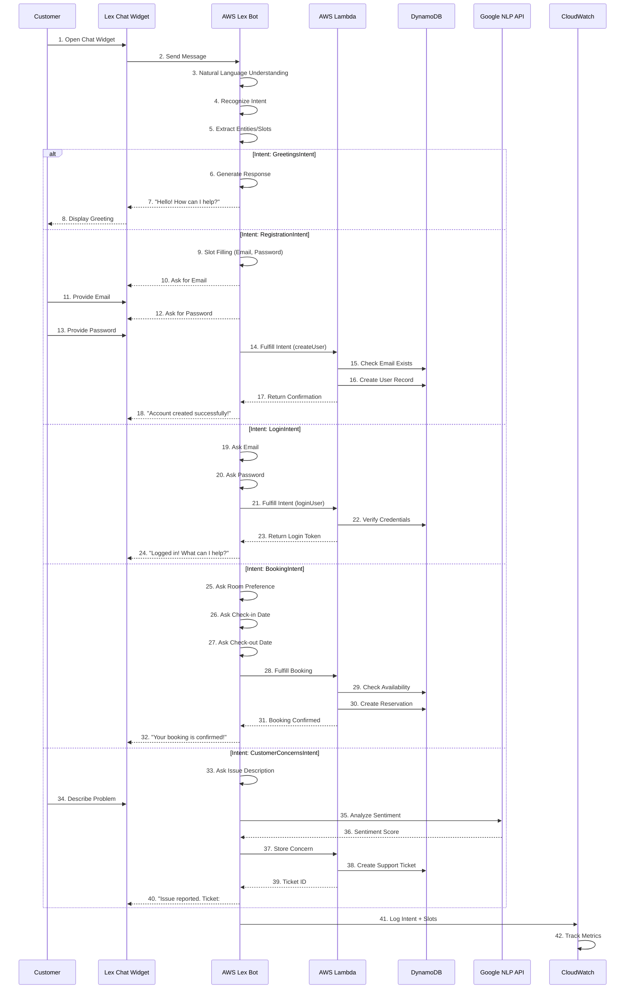
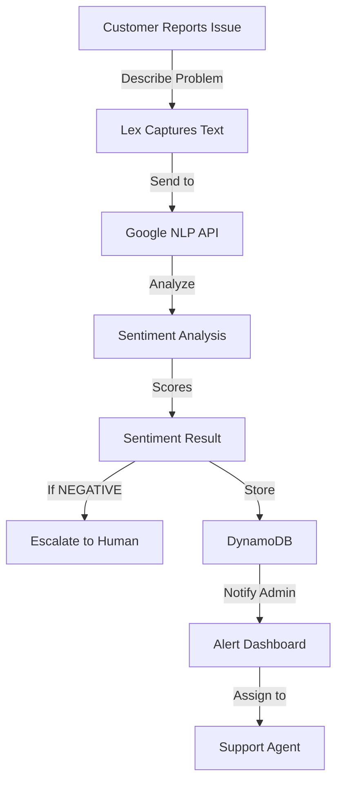

# Virtual Assistant (AWS Lex) Flow

## AWS Lex Conversational AI System

The DALVacationHome project implements AWS Lex as a virtual assistant to help customers with common inquiries about bookings, registration, login, and support issues.



## AWS Lex Intents

### 1. GreetingsIntent

```json
{
  "name": "GreetingsIntent",
  "description": "Handles user greetings and small talk",
  "sampleUtterances": [
    "Hi",
    "Hello",
    "Hey there",
    "Good morning",
    "How are you?",
    "What can you do?"
  ],
  "slots": [],
  "fulfillmentActivity": {
    "type": "ReturnIntent",
    "fulfillmentCodeHook": null
  },
  "responses": [
    "Hello! Welcome to DALVacationHome. How can I assist you today?",
    "Hi there! I'm here to help with bookings, account setup, or any questions about vacation homes.",
    "Greetings! What would you like to do today?"
  ]
}
```

### 2. RegistrationIntent

```json
{
  "name": "RegistrationIntent",
  "description": "Handles new user registration",
  "sampleUtterances": [
    "I want to create an account",
    "Register me",
    "Sign up",
    "Create a new account",
    "I'm a new user"
  ],
  "slots": [
    {
      "name": "EmailSlot",
      "type": "AMAZON.Email",
      "description": "User email address",
      "priority": 1,
      "sampleUtterances": [
        "My email is {EmailSlot}",
        "{EmailSlot}",
        "Email: {EmailSlot}"
      ]
    },
    {
      "name": "PasswordSlot",
      "type": "AMAZON.AlphaNumeric",
      "description": "User password",
      "priority": 2,
      "sampleUtterances": [
        "Password is {PasswordSlot}",
        "{PasswordSlot}"
      ]
    },
    {
      "name": "FullNameSlot",
      "type": "AMAZON.Person",
      "description": "User full name",
      "priority": 3
    }
  ],
  "fulfillmentActivity": {
    "type": "CodeHook",
    "codeHook": "arn:aws:lambda:us-east-1:123456789:function:lexRegistration"
  }
}
```

### 3. LoginIntent

```json
{
  "name": "LoginIntent",
  "description": "Handles user login",
  "sampleUtterances": [
    "I want to login",
    "Sign me in",
    "Log in",
    "I'm an existing user",
    "Access my account"
  ],
  "slots": [
    {
      "name": "EmailSlot",
      "type": "AMAZON.Email",
      "required": true
    },
    {
      "name": "PasswordSlot",
      "type": "AMAZON.AlphaNumeric",
      "required": true
    }
  ],
  "fulfillmentActivity": {
    "type": "CodeHook",
    "codeHook": "arn:aws:lambda:us-east-1:123456789:function:lexLogin"
  }
}
```

### 4. BookingIntent

```json
{
  "name": "BookingIntent",
  "description": "Handles vacation home booking requests",
  "sampleUtterances": [
    "I want to book a property",
    "Book a room",
    "Make a reservation",
    "I want to book from {CheckInDate} to {CheckOutDate}",
    "Can I book {PropertyType} in {Location}?"
  ],
  "slots": [
    {
      "name": "LocationSlot",
      "type": "AMAZON.City",
      "description": "Destination city",
      "required": true
    },
    {
      "name": "CheckInDate",
      "type": "AMAZON.Date",
      "description": "Check-in date",
      "required": true
    },
    {
      "name": "CheckOutDate",
      "type": "AMAZON.Date",
      "description": "Check-out date",
      "required": true
    },
    {
      "name": "PropertyTypeSlot",
      "type": "PROPERTY_TYPE",
      "description": "Type of property",
      "slotConstraint": "Optional",
      "customValues": ["Deluxe", "Standard", "Luxury", "Budget"]
    },
    {
      "name": "GuestCountSlot",
      "type": "AMAZON.Number",
      "description": "Number of guests"
    }
  ],
  "fulfillmentActivity": {
    "type": "CodeHook",
    "codeHook": "arn:aws:lambda:us-east-1:123456789:function:lexBooking"
  }
}
```

### 5. CustomerConcernsIntent

```json
{
  "name": "CustomerConcernsIntent",
  "description": "Handles customer support requests",
  "sampleUtterances": [
    "I have a problem",
    "I need help with my booking",
    "Something is wrong",
    "I want to report an issue",
    "Can I speak to support?",
    "I have a complaint"
  ],
  "slots": [
    {
      "name": "IssueDescriptionSlot",
      "type": "AMAZON.AlphaNumeric",
      "description": "Detailed issue description",
      "required": true
    },
    {
      "name": "BookingReferenceSlot",
      "type": "AMAZON.AlphaNumeric",
      "description": "Booking reference number",
      "required": false
    }
  ],
  "fulfillmentActivity": {
    "type": "CodeHook",
    "codeHook": "arn:aws:lambda:us-east-1:123456789:function:lexConcerns"
  }
}
```

## Lambda Fulfillment Functions

### Registration Fulfillment Handler

```python
def lambda_handler(event, context):
    """Lex Registration Intent Fulfillment"""
    intent_name = event['currentIntent']['name']
    slots = event['currentIntent']['slots']
    session_attributes = event['sessionAttributes'] or {}

    email = slots.get('EmailSlot')
    password = slots.get('PasswordSlot')
    full_name = slots.get('FullNameSlot')

    # Validate all slots are filled
    if not all([email, password, full_name]):
        return elicit_slot(
            session_attributes,
            intent_name,
            slots,
            'EmailSlot',
            'What email address would you like to use?'
        )

    try:
        # Check if email already exists
        dynamodb = boto3.resource('dynamodb')
        table = dynamodb.Table('Users')
        response = table.get_item(Key={'email': email})

        if 'Item' in response:
            return elicit_slot(
                session_attributes,
                intent_name,
                slots,
                'EmailSlot',
                'This email is already registered. Try another.'
            )

        # Create user
        user_id = str(uuid.uuid4())
        table.put_item(Item={
            'userId': user_id,
            'email': email,
            'passwordHash': hash_password(password),
            'fullName': full_name,
            'createdAt': datetime.now().isoformat()
        })

        return close(
            session_attributes,
            'Fulfilled',
            {
                'contentType': 'PlainText',
                'content': f'Welcome {full_name}! Your account has been created. Please verify your email.'
            }
        )

    except Exception as e:
        return close(
            session_attributes,
            'Failed',
            {
                'contentType': 'PlainText',
                'content': f'I encountered an error: {str(e)}. Please try again later.'
            }
        )

def elicit_slot(session_attr, intent_name, slots, slot_to_elicit, message):
    """Ask for a specific slot"""
    return {
        'sessionAttributes': session_attr,
        'dialogAction': {
            'type': 'ElicitSlot',
            'intentName': intent_name,
            'slots': slots,
            'slotToElicit': slot_to_elicit,
            'message': {
                'contentType': 'PlainText',
                'content': message
            }
        }
    }

def close(session_attr, fulfillment_state, message):
    """Close conversation"""
    return {
        'sessionAttributes': session_attr,
        'dialogAction': {
            'type': 'Close',
            'fulfillmentState': fulfillment_state,
            'message': message
        }
    }
```

## Natural Language Understanding (NLU)

```
User Input: "I want to book a luxury property in Malibu from Feb 15 to Feb 20"

NLU Processing:
├─ Tokenization:
│  ["I", "want", "to", "book", "a", "luxury", "property", ...]
│
├─ Intent Detection:
│  Intent: BookingIntent (confidence: 0.98)
│
└─ Entity Extraction:
   ├─ PropertyType: "luxury" (confidence: 0.95)
   ├─ Location: "Malibu" (confidence: 0.99)
   ├─ CheckInDate: "2024-02-15" (confidence: 0.99)
   └─ CheckOutDate: "2024-02-20" (confidence: 0.99)

Result: Slots Filled
├─ PropertyTypeSlot = "luxury"
├─ LocationSlot = "Malibu"
├─ CheckInDate = "2024-02-15"
├─ CheckOutDate = "2024-02-20"
└─ Proceed to Fulfillment
```

## Slot Filling Dialog Flow

```
System: "Welcome! What would you like to do?"
User: "I want to book a property"

Bot recognizes BookingIntent

Dialog Iteration 1:
System: "What location are you interested in?"
User: "Malibu"
Bot: LocationSlot = "Malibu" [filled]

Dialog Iteration 2:
System: "When do you want to check in?"
User: "February 15th"
Bot: CheckInDate = "2024-02-15" [filled]

Dialog Iteration 3:
System: "And when do you want to check out?"
User: "February 20th"
Bot: CheckOutDate = "2024-02-20" [filled]

All Slots Filled → Confirm & Proceed to Fulfillment
System: "Confirming booking in Malibu from Feb 15-20. Shall I proceed?"
User: "Yes"
Bot: Invoke Lambda Fulfillment Function
```

## Customer Concerns & Sentiment Analysis



### Concern Data Model

```json
{
  "concernId": "concern_xyz789",
  "userId": "user_abc123",
  "bookingId": "res_def456",
  "description": "The air conditioning was not working in my room",
  "sentiment": {
    "score": -0.85,
    "magnitude": 0.9,
    "sentimentType": "NEGATIVE"
  },
  "priority": "HIGH",
  "status": "OPEN",
  "category": "MAINTENANCE",
  "createdAt": "2024-01-20T14:30:00Z",
  "resolvedAt": null,
  "assignedTo": "support_agent_123",
  "resolution": null
}
```

## CloudWatch Monitoring

```python
import logging
from aws_lambda_powertools import Logger

logger = Logger()

def log_lex_interaction(event, intent, slots, response):
    """Log Lex interactions for monitoring"""
    logger.info(
        "Lex Interaction",
        extra={
            "userId": event['userId'],
            "intent": intent,
            "slots": slots,
            "fulfillment_status": response['dialogAction']['type'],
            "timestamp": datetime.now().isoformat()
        }
    )

    # CloudWatch Metrics
    cloudwatch = boto3.client('cloudwatch')
    cloudwatch.put_metric_data(
        Namespace='DALVacationHome/Lex',
        MetricData=[
            {
                'MetricName': 'IntentProcessed',
                'Value': 1,
                'Unit': 'Count',
                'Dimensions': [
                    {'Name': 'Intent', 'Value': intent}
                ]
            }
        ]
    )
```

## Lex Chatbot Widget Integration (Frontend)

```javascript
import AmazonLexEvents from 'amazon-lex-web-ui-loader';

// Initialize Lex
AmazonLexEvents.loader.load(
  {
    credentials: {
      accessKey: AWS_ACCESS_KEY,
      secretKey: AWS_SECRET_KEY,
      region: 'us-east-1'
    },
    lexruntime: {
      botName: 'DALVacationHomeBot',
      botAlias: 'PROD',
      userId: currentUserId
    }
  },
  'lexDiv'  // Container element ID
);

// Listen for Lex events
const lexInstance = AmazonLexEvents.chatbotUI;

lexInstance.messageHandler.onMessage(
  (message) => {
    console.log('Message from Lex:', message);
    // Update UI based on response
  }
);

lexInstance.messageHandler.onError(
  (error) => {
    console.error('Lex Error:', error);
    // Show error to user
  }
);
```

## Handling Multi-Turn Conversations

```
Turn 1:
User: "I want to book a room"
Lex: "What dates are you interested in?"

Turn 2:
User: "February 15 to 20"
Lex: "What location do you prefer?"

Turn 3:
User: "Malibu"
Lex: Confirms all details and fulfills booking

Session Attributes:
{
  "bookingContext": {
    "checkInDate": "2024-02-15",
    "checkOutDate": "2024-02-20",
    "location": "Malibu",
    "conversationHistory": [
      {"turn": 1, "user": "...", "bot": "..."},
      {"turn": 2, "user": "...", "bot": "..."},
      {"turn": 3, "user": "...", "bot": "..."}
    ]
  }
}
```

## Performance & Scaling

### Lex Metrics Tracked

```
Dashboard Metrics:
├─ Intents Recognized: Count by intent type
├─ Session Count: Active concurrent sessions
├─ Fulfillment Rate: % of successful intents
├─ User Satisfaction: Rating after interaction
├─ Response Time: Latency of Lex responses
├─ Error Rate: Failed intents
├─ Fallback Intent Rate: Unrecognized inputs
└─ Common Unanswered Questions: Gaps in intents
```

### Scaling Considerations

```
AWS Lex Auto-Scaling:
├─ Handles 100+ concurrent conversations
├─ No pre-warming required
├─ Lambda integration auto-scales
├─ DynamoDB on-demand for slot data
└─ No infrastructure management needed
```

---

See related flows:
- [Feedback & Sentiment Analysis](./06-feedback-analytics-flow.md)
- [System Architecture](./01-system-architecture.md)
