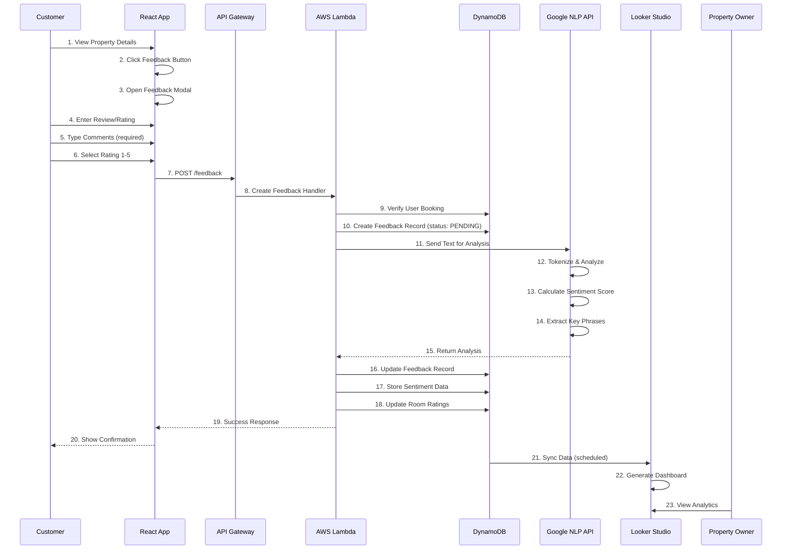
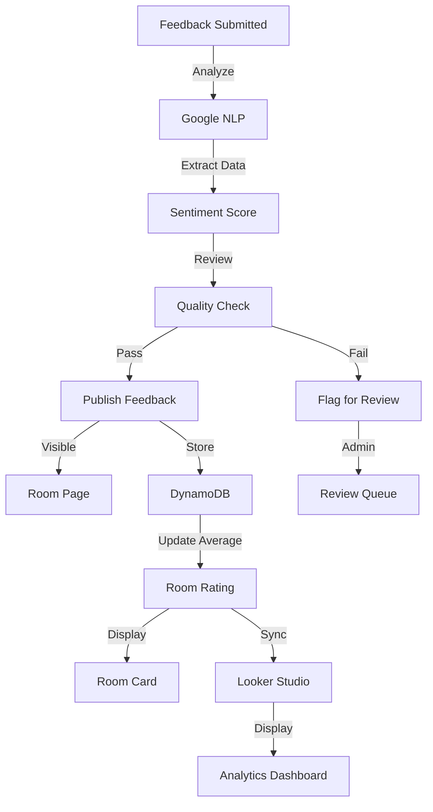
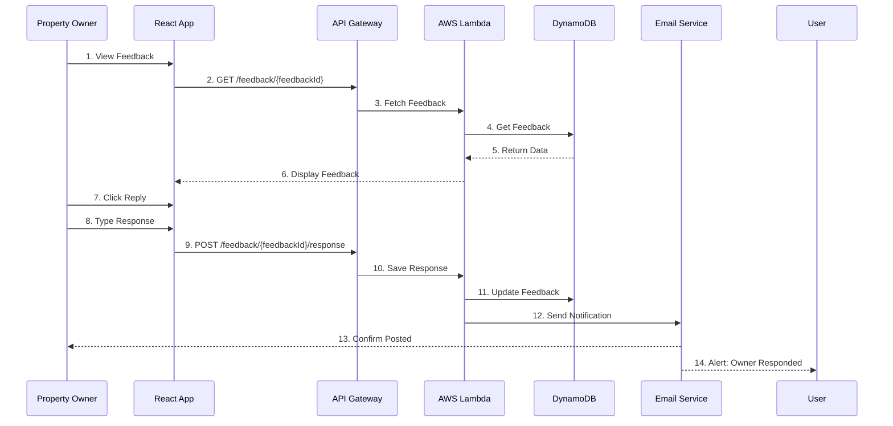

# Feedback & Sentiment Analysis Flow

## Feedback Submission & Analysis Pipeline



## Feedback Data Model

```json
{
  "feedbackId": "fb_xyz789",
  "userId": "user_abc123",
  "userName": "John Doe",
  "roomId": "room_123",
  "roomName": "Deluxe Ocean View Suite",
  "bookingId": "res_def456",
  "userAvatar": "https://avatar.url",
  "rating": 4.5,
  "title": "Amazing view, minor maintenance issue",
  "description": "The room was beautiful with stunning ocean views. However, the air conditioning was a bit noisy at night. Staff was helpful in fixing it quickly.",
  "sentiment": {
    "score": 0.72,
    "magnitude": 0.85,
    "sentimentType": "POSITIVE",
    "confidence": 0.94
  },
  "categories": {
    "cleanliness": 5,
    "amenities": 4,
    "serviceQuality": 5,
    "valueForMoney": 4,
    "location": 5
  },
  "keyPhrases": [
    {
      "phrase": "stunning ocean views",
      "sentiment": "POSITIVE"
    },
    {
      "phrase": "helpful staff",
      "sentiment": "POSITIVE"
    },
    {
      "phrase": "noisy air conditioning",
      "sentiment": "NEGATIVE"
    }
  ],
  "status": "PUBLISHED",
  "verified": true,
  "helpful": 5,
  "notHelpful": 0,
  "createdAt": "2024-01-20T14:30:00Z",
  "updatedAt": "2024-01-20T14:30:00Z",
  "publishedAt": "2024-01-20T14:35:00Z",
  "reviewerType": "VERIFIED_GUEST",
  "ownerResponse": {
    "message": "Thank you for the feedback! We're glad you enjoyed the view...",
    "respondedAt": "2024-01-21T10:00:00Z"
  }
}
```

## Google NLP Sentiment Analysis

### Sentiment Analysis Process

```python
from google.cloud import language_v1

def analyze_feedback_sentiment(text):
    """Analyze feedback text for sentiment"""
    client = language_v1.LanguageServiceClient()

    document = language_v1.Document(
        content=text,
        type_=language_v1.Document.Type.PLAIN_TEXT,
        language="en"
    )

    # Analyze sentiment
    response = client.analyze_sentiment(
        request={'document': document}
    )

    sentiment_score = response.document_sentiment.score  # -1.0 to 1.0
    magnitude = response.document_sentiment.magnitude    # 0.0 to +inf

    return {
        'score': sentiment_score,
        'magnitude': magnitude,
        'sentimentType': classify_sentiment(sentiment_score),
        'sentences': [
            {
                'text': sentence.text.content,
                'sentiment': sentence.sentiment.score,
                'magnitude': sentence.sentiment.magnitude
            }
            for sentence in response.sentences
        ]
    }

def classify_sentiment(score):
    """Classify sentiment into categories"""
    if score > 0.25:
        return 'POSITIVE'
    elif score < -0.25:
        return 'NEGATIVE'
    else:
        return 'NEUTRAL'
```

### Entity Analysis

```python
def extract_entities(text):
    """Extract named entities and key terms"""
    client = language_v1.LanguageServiceClient()

    document = language_v1.Document(
        content=text,
        type_=language_v1.Document.Type.PLAIN_TEXT,
        language="en"
    )

    response = client.analyze_entities(
        request={'document': document}
    )

    entities = []
    for entity in response.entities:
        entities.append({
            'name': entity.name,
            'type': entity.type_.name,
            'salience': entity.salience,
            'mentions': [
                {
                    'text': mention.text.content,
                    'sentiment': mention.sentiment.score if mention.sentiment else 0
                }
                for mention in entity.mentions
            ]
        })

    return entities
```

### Syntax Analysis (Key Phrases)

```python
def extract_key_phrases(text):
    """Extract important phrases and keywords"""
    client = language_v1.LanguageServiceClient()

    document = language_v1.Document(
        content=text,
        type_=language_v1.Document.Type.PLAIN_TEXT,
        language="en"
    )

    response = client.analyze_syntax(
        request={'document': document}
    )

    # Extract adjectives and noun phrases
    key_phrases = []
    for token in response.tokens:
        if token.part_of_speech.tag.name in ['ADJ', 'NOUN']:
            key_phrases.append(token.text.content)

    return key_phrases
```

## Feedback Publishing Flow



## Feedback Aggregation

```python
def calculate_room_rating(room_id):
    """Calculate aggregate rating for a room"""
    dynamodb = boto3.resource('dynamodb')
    table = dynamodb.Table('Feedback')

    # Query all feedback for this room
    response = table.query(
        IndexName='roomId-createdAt-index',
        KeyConditionExpression='roomId = :roomId',
        ExpressionAttributeValues={
            ':roomId': room_id
        }
    )

    feedbacks = response['Items']

    if not feedbacks:
        return None

    # Calculate averages
    avg_rating = sum(f['rating'] for f in feedbacks) / len(feedbacks)
    avg_sentiment = sum(f['sentiment']['score'] for f in feedbacks) / len(feedbacks)
    verified_count = sum(1 for f in feedbacks if f.get('verified'))

    # Category breakdowns
    categories = {
        'cleanliness': [],
        'amenities': [],
        'serviceQuality': [],
        'valueForMoney': [],
        'location': []
    }

    for feedback in feedbacks:
        for cat, rating in feedback.get('categories', {}).items():
            categories[cat].append(rating)

    avg_categories = {
        cat: sum(ratings) / len(ratings) if ratings else 0
        for cat, ratings in categories.items()
    }

    return {
        'roomId': room_id,
        'overallRating': round(avg_rating, 2),
        'sentimentScore': round(avg_sentiment, 2),
        'totalReviews': len(feedbacks),
        'verifiedReviews': verified_count,
        'categoryBreakdown': avg_categories,
        'lastUpdated': datetime.now().isoformat()
    }
```

## Feedback Listing with Sentiment Display

```json
{
  "feedbacks": [
    {
      "feedbackId": "fb_001",
      "author": "John Doe",
      "rating": 5,
      "title": "Exceptional property!",
      "description": "Amazing views and excellent service.",
      "sentiment": {
        "type": "POSITIVE",
        "score": 0.95,
        "badge": "👍 Positive"
      },
      "createdAt": "2024-01-20T14:30:00Z",
      "verified": true
    },
    {
      "feedbackId": "fb_002",
      "author": "Jane Smith",
      "rating": 2,
      "title": "Poor maintenance",
      "description": "The room needed cleaning and repairs.",
      "sentiment": {
        "type": "NEGATIVE",
        "score": -0.85,
        "badge": "👎 Negative"
      },
      "createdAt": "2024-01-19T10:20:00Z",
      "verified": true
    }
  ]
}
```

## Analytics Dashboard (Looker Studio Integration)

```
Room Performance Dashboard
═══════════════════════════════════════════════════════

Overall Rating: ⭐ 4.3/5.0
(Based on 47 verified reviews)

Sentiment Analysis:
├─ Positive: 78% 😊
├─ Neutral: 15% 😐
└─ Negative: 7% 😞

Category Breakdown:
├─ Cleanliness: 4.6/5.0
├─ Amenities: 4.2/5.0
├─ Service Quality: 4.7/5.0
├─ Value for Money: 4.1/5.0
└─ Location: 4.8/5.0

Top Positive Mentions:
├─ Amazing views
├─ Friendly staff
├─ Clean & spacious
└─ Great location

Top Concerns:
├─ Noisy air conditioning (3 mentions)
├─ Parking limited (2 mentions)
└─ WiFi connectivity (1 mention)

Recent Reviews (Last 30 Days):
├─ 5-star: 12 reviews
├─ 4-star: 8 reviews
├─ 3-star: 3 reviews
├─ 2-star: 1 review
└─ 1-star: 0 reviews

Trend: ↑ 8% increase in ratings (vs last month)
```

## Feedback Moderation

### Automated Checks

```python
def validate_feedback(feedback_data):
    """Validate feedback before publishing"""

    issues = []

    # 1. Content validation
    if len(feedback_data['description']) < 10:
        issues.append('Review too short (min 10 chars)')

    if len(feedback_data['description']) > 5000:
        issues.append('Review too long (max 5000 chars)')

    # 2. Language check
    if is_profanity(feedback_data['description']):
        issues.append('Inappropriate language detected')

    # 3. Spam detection
    if is_spam(feedback_data['description']):
        issues.append('Potential spam detected')

    # 4. Rating consistency
    if feedback_data['rating'] == 1 and sentiment_score > 0.7:
        issues.append('Rating inconsistent with text sentiment')

    # 5. Verification
    if not verify_booking(feedback_data['userId'], feedback_data['roomId']):
        issues.append('Reviewer did not book this room')

    return {
        'isValid': len(issues) == 0,
        'issues': issues,
        'requiresReview': len(issues) > 0
    }
```

## Owner Response to Feedback



## Feedback Analytics Queries

### Get Room Rating Summary

```
GET /feedback/rooms/{roomId}/summary

Response:
{
  "roomId": "room_123",
  "averageRating": 4.3,
  "totalReviews": 47,
  "sentimentBreakdown": {
    "positive": 36,
    "neutral": 7,
    "negative": 4
  },
  "categoryScores": {
    "cleanliness": 4.6,
    "amenities": 4.2,
    "serviceQuality": 4.7,
    "valueForMoney": 4.1,
    "location": 4.8
  },
  "ratingDistribution": {
    "5": 23,
    "4": 15,
    "3": 6,
    "2": 2,
    "1": 1
  }
}
```

### Get Feedback List with Sentiment

```
GET /feedback/rooms/{roomId}?limit=10&offset=0&sort=recent

Response:
[
  {
    "feedbackId": "fb_001",
    "author": "John Doe",
    "rating": 5,
    "sentiment": "POSITIVE",
    "title": "Amazing!",
    "createdAt": "2024-01-20T14:30:00Z"
  },
  ...
]
```

## Data Flow: Feedback to Analytics

```
User Submits Feedback
        ↓
Lambda Receives Request
        ↓
Validate Feedback
        ↓
Store in DynamoDB
        ↓
Send to Google NLP
        ↓
Receive Sentiment Score
        ↓
Update DynamoDB with Sentiment
        ↓
Publish Analytics Event
        ↓
GCP Cloud Function Processes
        ↓
Update Analytics Table
        ↓
Looker Studio Queries Data
        ↓
Dashboard Updates Automatically
```


## API Endpoints for Feedback

| Endpoint | Method | Purpose |
|----------|--------|---------|
| `/feedback` | POST | Submit new feedback |
| `/feedback/{feedbackId}` | GET | Get feedback details |
| `/feedback/rooms/{roomId}` | GET | List room feedback |
| `/feedback/rooms/{roomId}/summary` | GET | Get room rating summary |
| `/feedback/{feedbackId}/response` | POST | Owner responds to feedback |
| `/feedback/user/{userId}` | GET | Get user's feedback |
| `/feedback/analytics/dashboard` | GET | Analytics dashboard data |

---

See related flows:
- [Virtual Assistant Flow](./05-virtual-assistant-flow.md)
- [System Architecture](./01-system-architecture.md)
