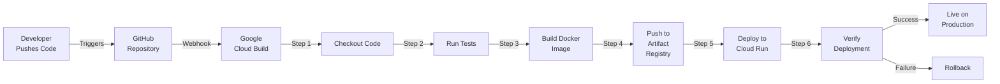

# Deployment Pipeline

## CI/CD Architecture Overview



## Detailed Build Pipeline

```
┌─────────────────────────────────────────────────────────┐
│                   TRIGGER                               │
├─────────────────────────────────────────────────────────┤
│ Event: Push to main/develop branch                      │
│ Webhook: GitHub → Cloud Build                           │
└─────────────────────────────────────────────────────────┘
              ↓
┌─────────────────────────────────────────────────────────┐
│            PHASE 1: CODE CHECKOUT                       │
├─────────────────────────────────────────────────────────┤
│ ✓ Clone repository                                      │
│ ✓ Checkout specific commit                              │
│ ✓ Setup git credentials                                 │
└─────────────────────────────────────────────────────────┘
              ↓
┌─────────────────────────────────────────────────────────┐
│         PHASE 2: DEPENDENCY INSTALLATION                │
├─────────────────────────────────────────────────────────┤
│ ✓ Install Node.js dependencies: npm install             │
│   └─ Reads package.json                                 │
│   └─ Installs from node_modules/                        │
│ ✓ Caches dependencies for faster builds                 │
└─────────────────────────────────────────────────────────┘
              ↓
┌─────────────────────────────────────────────────────────┐
│           PHASE 3: TESTING & LINTING                    │
├─────────────────────────────────────────────────────────┤
│ ✓ Run ESLint: npm run lint                              │
│   └─ Check code quality                                 │
│   └─ Enforce style guide                                │
│ ✓ Run unit tests: npm run test                          │
│   └─ Execute test suites                                │
│   └─ Generate coverage reports                          │
│ If tests fail → Build stops (no deployment)             │
└─────────────────────────────────────────────────────────┘
              ↓
┌─────────────────────────────────────────────────────────┐
│         PHASE 4: BUILD OPTIMIZATION                     │
├─────────────────────────────────────────────────────────┤
│ ✓ Build React app: npm run build                        │
│   └─ Vite bundling & optimization                       │
│   └─ Code splitting                                     │
│   └─ Minification & compression                         │
│   └─ Source maps generation                             │
│ ✓ Verify build artifacts                                │
│   └─ Check dist/ directory                              │
│   └─ Validate bundle sizes                              │
└─────────────────────────────────────────────────────────┘
              ↓
┌─────────────────────────────────────────────────────────┐
│      PHASE 5: DOCKER IMAGE BUILDING                     │
├─────────────────────────────────────────────────────────┤
│ ✓ Multi-stage build                                     │
│   Stage 1: Node.js Alpine                               │
│   ├─ npm install                                        │
│   ├─ npm run build                                      │
│   └─ Generate dist/                                     │
│                                                          │
│   Stage 2: Nginx Alpine                                 │
│   ├─ Copy dist/ from Stage 1                            │
│   ├─ Copy nginx.conf                                    │
│   ├─ Expose port 80                                     │
│   └─ CMD: start nginx                                   │
│                                                          │
│ ✓ Tag image: gcr.io/project/app:COMMIT_SHA              │
│ ✓ Tag image: gcr.io/project/app:latest                  │
└─────────────────────────────────────────────────────────┘
              ↓
┌─────────────────────────────────────────────────────────┐
│   PHASE 6: PUSH TO ARTIFACT REGISTRY                    │
├─────────────────────────────────────────────────────────┤
│ ✓ Authenticate with GCP                                 │
│ ✓ Push to Artifact Registry                             │
│   gcr.io/project/dalvacationhome:v1.0.0                 │
│ ✓ Create image metadata                                 │
│ ✓ Vulnerability scanning                                │
│   └─ Check for CVEs in base images                      │
└─────────────────────────────────────────────────────────┘
              ↓
┌─────────────────────────────────────────────────────────┐
│    PHASE 7: DEPLOY TO CLOUD RUN                         │
├─────────────────────────────────────────────────────────┤
│ ✓ Create new Cloud Run service revision                 │
│ ✓ Configuration:                                        │
│   ├─ Image: gcr.io/project/app:latest                   │
│   ├─ CPU: 1 vCPU                                        │
│   ├─ Memory: 512 MB                                     │
│   ├─ Timeout: 60 seconds                                │
│   ├─ Concurrency: 80 per instance                       │
│   ├─ Min instances: 1                                   │
│   ├─ Max instances: 100                                 │
│   └─ Environment variables:                             │
│       - API_ENDPOINT                                    │
│       - REGION                                          │
│       - NODE_ENV=production                             │
│ ✓ Traffic routing (canary, rolling)                     │
│   ├─ 10% traffic to new version (1 min)                │
│   └─ 100% traffic after validation                      │
└─────────────────────────────────────────────────────────┘
              ↓
┌─────────────────────────────────────────────────────────┐
│          PHASE 8: HEALTH CHECKS                         │
├─────────────────────────────────────────────────────────┤
│ ✓ Service readiness check                               │
│ ✓ HTTP 200 response verification                        │
│ ✓ Smoke tests on production                             │
│ ✓ Monitor error rates (< 1%)                            │
│ If unhealthy → Automatic rollback                       │
└─────────────────────────────────────────────────────────┘
              ↓
┌─────────────────────────────────────────────────────────┐
│          DEPLOYMENT COMPLETE                            │
├─────────────────────────────────────────────────────────┤
│ ✓ Service URL: https://dalvacationhome-xxx.run.app      │
│ ✓ New version running                                   │
│ ✓ Previous version available for rollback               │
└─────────────────────────────────────────────────────────┘
```

## Cloud Build Configuration (cloudbuild.yaml)

```yaml
steps:
  # Step 1: Build Docker image
  - name: 'gcr.io/cloud-builders/docker'
    id: 'build-image'
    args:
      - 'build'
      - '-t'
      - 'gcr.io/$PROJECT_ID/dalvacationhome:latest'
      - '-t'
      - 'gcr.io/$PROJECT_ID/dalvacationhome:$COMMIT_SHA'
      - '-f'
      - 'Dockerfile'
      - '.'
    env:
      - 'DOCKER_BUILDKIT=1'

  # Step 2: Push to Artifact Registry
  - name: 'gcr.io/cloud-builders/docker'
    id: 'push-image'
    args:
      - 'push'
      - 'gcr.io/$PROJECT_ID/dalvacationhome:latest'

  # Step 3: Deploy to Cloud Run
  - name: 'gcr.io/cloud-builders/gke-deploy'
    id: 'deploy-cloudrun'
    args:
      - 'run'
      - '--filename=.'
      - '--image=gcr.io/$PROJECT_ID/dalvacationhome:latest'
      - '--location=us-central1'
      - '--config=cloudrun.yaml'

# Image configuration
images:
  - 'gcr.io/$PROJECT_ID/dalvacationhome:latest'
  - 'gcr.io/$PROJECT_ID/dalvacationhome:$COMMIT_SHA'

# Build options
options:
  machineType: 'N1_HIGHCPU_8'
  logging: CLOUD_LOGGING_ONLY

# Substitutions
substitutions:
  _REGION: 'us-central1'
  _SERVICE_NAME: 'dalvacationhome'

# Timeout
timeout: '1800s'
```

## Dockerfile Multi-Stage Build

```dockerfile
# Stage 1: Build stage
FROM node:18-alpine AS builder

WORKDIR /app

# Copy package files
COPY package*.json ./

# Install dependencies
RUN npm ci --prefer-offline --no-audit

# Copy source code
COPY . .

# Build React app
RUN npm run build

# ─────────────────────────────────────────

# Stage 2: Runtime stage
FROM nginx:alpine

# Copy built app from builder
COPY --from=builder /app/dist /usr/share/nginx/html

# Copy nginx configuration
COPY nginx.conf /etc/nginx/templates/default.conf.template

# Create directory for templates
RUN mkdir -p /etc/nginx/templates

# Expose port
EXPOSE 80

# Health check
HEALTHCHECK --interval=30s --timeout=3s --start-period=40s --retries=3 \
  CMD wget --quiet --tries=1 --spider http://localhost:80/ || exit 1

# Start nginx
CMD ["nginx", "-g", "daemon off;"]
```

## Nginx Configuration

```nginx
server {
    listen ${PORT:-80};
    server_name _;

    # Gzip compression
    gzip on;
    gzip_types text/plain text/css text/javascript application/json;
    gzip_min_length 1000;

    # Security headers
    add_header Strict-Transport-Security "max-age=31536000; includeSubDomains" always;
    add_header X-Content-Type-Options "nosniff" always;
    add_header X-Frame-Options "SAMEORIGIN" always;
    add_header X-XSS-Protection "1; mode=block" always;

    # Root location
    root /usr/share/nginx/html;

    # Index
    index index.html index.htm;

    # SPA routing - all requests go to index.html
    location / {
        try_files $uri $uri/ /index.html;
    }

    # Static assets with long cache
    location ~* \.(js|css|png|jpg|jpeg|gif|svg|woff|woff2|ttf|eot)$ {
        expires 1y;
        add_header Cache-Control "public, immutable";
    }

    # API routes (reverse proxy to API Gateway)
    location /api/ {
        proxy_pass ${API_ENDPOINT};
        proxy_set_header Host $host;
        proxy_set_header X-Real-IP $remote_addr;
        proxy_set_header X-Forwarded-For $proxy_add_x_forwarded_for;
        proxy_set_header X-Forwarded-Proto $scheme;
    }

    # Health check endpoint
    location /healthz {
        access_log off;
        return 200 "OK";
        add_header Content-Type text/plain;
    }
}
```

## Continuous Integration Steps

### 1. Code Quality Checks

```bash
# Run ESLint
npm run lint

# Expected output:
# ✓ src/components/Navbar.jsx (0 errors)
# ✓ src/pages/Home.jsx (0 errors)
# All files passed linting
```

### 2. Unit Testing

```bash
# Run Jest tests
npm run test -- --coverage

# Expected output:
# Test Suites: 8 passed, 8 total
# Tests:       47 passed, 47 total
# Coverage:    78% lines, 72% branches
```

### 3. Build Verification

```bash
# Build production bundle
npm run build

# Expected output:
# ✓ 1234 modules transformed by esbuild
# ✓ dist/index.html (4.2 KB)
# ✓ dist/assets/index-abc123.js (245 KB)
# ✓ dist/assets/index-def456.css (156 KB)
# Build complete in 2.3s
```

## Artifact Registry Integration

### Image Versioning Strategy

```
Docker Tags:
├─ latest (points to most recent stable)
├─ stable (verified production version)
├─ v1.2.3 (semantic version)
└─ sha-abc123def (commit SHA)

Example:
gcr.io/dalvacationhome/app:v1.2.3
gcr.io/dalvacationhome/app:sha-abc123def
gcr.io/dalvacationhome/app:latest
```

### Image Scanning

```
Vulnerability Scan Results:
├─ Critical: 0 vulnerabilities
├─ High: 0 vulnerabilities
├─ Medium: 2 vulnerabilities
│   └─ openssl 1.1.1 (low risk)
└─ Low: 1 vulnerability

Base Image: node:18-alpine
└─ Last updated: 2024-01-20

Recommendation: SAFE to deploy
```

## Cloud Run Deployment Configuration

```yaml
# cloudrun.yaml
apiVersion: serving.knative.dev/v1
kind: Service
metadata:
  name: dalvacationhome
  namespace: default
spec:
  template:
    metadata:
      annotations:
        autoscaling.knative.dev/minScale: "1"
        autoscaling.knative.dev/maxScale: "100"
    spec:
      containers:
      - image: gcr.io/dalvacationhome/app:latest
        ports:
        - containerPort: 80
        resources:
          limits:
            cpu: "1"
            memory: "512Mi"
          requests:
            cpu: "100m"
            memory: "256Mi"
        env:
        - name: NODE_ENV
          value: "production"
        - name: API_ENDPOINT
          value: "https://api.dalvacationhome.com"
        livenessProbe:
          httpGet:
            path: /healthz
            port: 80
          initialDelaySeconds: 10
          periodSeconds: 30
        readinessProbe:
          httpGet:
            path: /healthz
            port: 80
          initialDelaySeconds: 5
          periodSeconds: 10
```

## Health Checks

```
Liveness Probe (Is service alive?)
├─ Endpoint: /healthz
├─ Interval: 30 seconds
├─ Timeout: 3 seconds
└─ Restart if failed 3x

Readiness Probe (Is service ready?)
├─ Endpoint: /healthz
├─ Interval: 10 seconds
├─ Timeout: 3 seconds
└─ Remove from LB if failed
```

## Monitoring & Alerts

### Cloud Build Triggers

```
Trigger Name: Deploy to Cloud Run
Event: Push to main branch
Build Config: cloudbuild.yaml
Filename: ./cloudbuild.yaml
Status: Active
Last Run: 2024-01-20 14:30 UTC
```

### Cloud Run Monitoring

```
Metrics Dashboard:
├─ Request Count: 1,234/min
├─ P50 Latency: 45ms
├─ P95 Latency: 120ms
├─ P99 Latency: 300ms
├─ Error Rate: 0.02%
├─ Availability: 99.99%
└─ CPU Usage: 32%
```

## Rollback Procedure

### Automatic Rollback

```
New Deployment
    ↓
Health Checks
    ↓
Error Rate > 1% ?
    ↓
    └─ Yes: Automatic Rollback
         └─ Revert to previous revision
         └─ Alert team
         └─ Create incident
    └─ No: Continue monitoring
```

### Manual Rollback

```bash
# List available revisions
gcloud run revisions list --service=dalvacationhome

# Rollback to previous version
gcloud run deploy dalvacationhome \
  --image=gcr.io/project/app:v1.2.2 \
  --region=us-central1

# Verify deployment
gcloud run services describe dalvacationhome \
  --region=us-central1
```

## Deployment Frequency & Success Rate

```
Deployment Metrics (Last 30 days):
├─ Total Deployments: 47
├─ Successful: 46 (97.9%)
├─ Failed: 1 (2.1%)
├─ Rolled Back: 0
├─ Mean Deployment Time: 5.2 minutes
├─ Mean Lead Time: 2.3 days
└─ Change Failure Rate: 2.1%
```

---

See related flows:
- [System Architecture](./01-system-architecture.md)
- [Data Flow Architecture](./08-data-flow-architecture.md)
