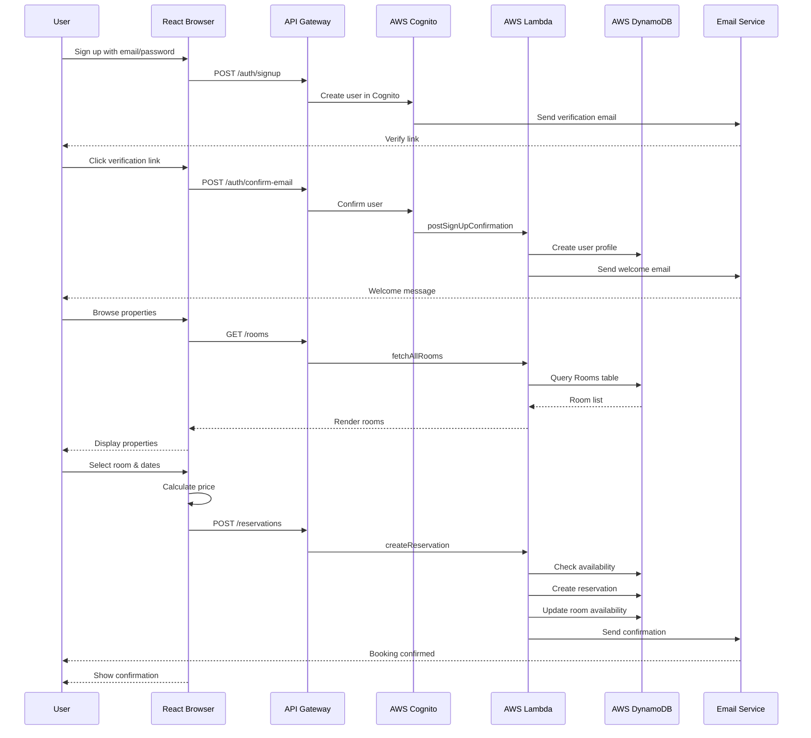
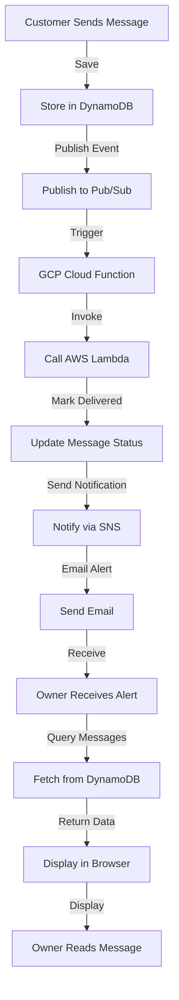

# Data Flow Architecture

## Complete End-to-End Data Flows

### Flow 1: User Registration to Booking



### Flow 2: Real-Time Messaging



### Flow 3: Feedback to Analytics Pipeline

```
Customer Submits Feedback
    ├─ Text: "Amazing ocean views! AC was noisy."
    ├─ Rating: 4.5/5
    └─ Categories: Cleanliness, Amenities, Service
        ↓
Store in DynamoDB (PENDING)
        ↓
Send to Google NLP API
        ├─ Tokenization
        ├─ Sentiment Analysis: 0.72 (POSITIVE)
        ├─ Entity Extraction: ocean views, AC
        └─ Intent Recognition
        ↓
Update DynamoDB with Sentiment
    ├─ status: PUBLISHED
    ├─ sentimentScore: 0.72
    ├─ keyPhrases: ["ocean views", "AC"]
    └─ categories: {...}
        ↓
Recalculate Room Rating
    ├─ Average rating: 4.3/5
    ├─ Average sentiment: 0.68
    └─ Total reviews: 47
        ↓
Publish to GCP Pub/Sub
        ↓
Cloud Function Processor
        ↓
Update Analytics Table in DynamoDB
        ↓
Looker Studio Dashboard
    ├─ Charts update automatically
    ├─ Room rating changes
    └─ Owner sees new review

```

## DynamoDB Data Schema

### Tables Overview

```
┌─────────────────────────────────────────┐
│            DynamoDB Tables              │
├─────────────────────────────────────────┤
│                                         │
│ 1. Users                                │
│    PK: userId                           │
│    SK: —                                │
│    GSI: email (unique)                  │
│                                         │
│ 2. Rooms                                │
│    PK: roomId                           │
│    SK: —                                │
│    GSI: location, priceRange             │
│    GSI: ownerId-createdAt               │
│                                         │
│ 3. Reservations                         │
│    PK: reservationId                    │
│    SK: —                                │
│    GSI: userId-createdAt                │
│    GSI: roomId-checkInDate              │
│                                         │
│ 4. Feedback                             │
│    PK: feedbackId                       │
│    SK: —                                │
│    GSI: roomId-createdAt                │
│    GSI: userId-createdAt                │
│                                         │
│ 5. Messages                             │
│    PK: conversationId                   │
│    SK: createdAt (sort)                 │
│    GSI: senderId-createdAt              │
│    GSI: receiverId-createdAt            │
│                                         │
│ 6. Conversations                        │
│    PK: conversationId                   │
│    SK: —                                │
│    GSI: userId-participant              │
│    GSI: lastMessageAt                   │
│                                         │
│ 7. Concerns                             │
│    PK: concernId                        │
│    SK: —                                │
│    GSI: userId-createdAt                │
│    GSI: status-priority                 │
│                                         │
└─────────────────────────────────────────┘
```

### Query Patterns

#### Get User's Bookings

```
Table: Reservations
Index: userId-createdAt-index

Query:
├─ Partition Key: userId = "user_123"
├─ Sort by: createdAt DESC
└─ Filter: status = "CONFIRMED"

Result: [Reservation, Reservation, ...]
```

#### Check Room Availability

```
Table: Reservations
Index: roomId-checkInDate-index

Query:
├─ Partition Key: roomId = "room_456"
├─ Check: No overlapping dates
│  ├─ checkInDate between requested dates?
│  └─ checkOutDate between requested dates?
└─ Result: Boolean (available or not)
```

#### Get Room Feedback

```
Table: Feedback
Index: roomId-createdAt-index

Query:
├─ Partition Key: roomId = "room_456"
├─ Sort by: createdAt DESC
├─ Filter: status = "PUBLISHED"
├─ Limit: 50 (pagination)
└─ Result: [Feedback, Feedback, ...]
```

#### Get Conversation Messages

```
Table: Messages
Primary: conversationId, createdAt

Query:
├─ Partition Key: conversationId = "conv_789"
├─ Sort by: createdAt DESC (latest first)
├─ Limit: 50 per page
└─ Result: [Message, Message, ...]
```

## Data Consistency & Transactions

### Atomic Booking Operation

```python
def create_reservation_atomic(reservation_data):
    """Atomic transaction for booking"""

    dynamodb = boto3.client('dynamodb')

    try:
        # Start transaction
        response = dynamodb.transact_write_items(
            TransactItems=[
                {
                    'Put': {
                        'TableName': 'Reservations',
                        'Item': reservation_data,
                        'ConditionExpression': 'attribute_not_exists(reservationId)'
                    }
                },
                {
                    'Update': {
                        'TableName': 'Rooms',
                        'Key': {'roomId': reservation_data['roomId']},
                        'UpdateExpression': 'SET #reserved = #reserved + :inc',
                        'ExpressionAttributeNames': {'#reserved': 'reservedDates'},
                        'ExpressionAttributeValues': {':inc': [date_range]},
                        'ConditionExpression': 'attribute_exists(roomId)'
                    }
                }
            ]
        )

        return {'status': 'success', 'reservationId': reservation_data['reservationId']}

    except ClientError as e:
        if e.response['Error']['Code'] == 'ValidationException':
            # Transaction conflict - room already booked
            return {'status': 'error', 'message': 'Room not available'}
        raise
```

## Lambda to DynamoDB Query Patterns

### 1. Simple Get (by Primary Key)

```python
# O(1) performance
response = dynamodb.get_item(
    TableName='Users',
    Key={'userId': {'S': 'user_123'}}
)
user = response.get('Item')
```

### 2. Query (by Partition Key)

```python
# O(log n) performance
response = dynamodb.query(
    TableName='Reservations',
    KeyConditionExpression='userId = :userId',
    ExpressionAttributeValues={
        ':userId': {'S': 'user_123'}
    },
    ScanIndexForward=False  # Newest first
)
reservations = response['Items']
```

### 3. Query with Filter

```python
# O(n) performance but filtered
response = dynamodb.query(
    TableName='Feedback',
    IndexName='roomId-createdAt-index',
    KeyConditionExpression='roomId = :roomId',
    FilterExpression='#status = :status AND #rating > :minRating',
    ExpressionAttributeNames={
        '#status': 'status',
        '#rating': 'rating'
    },
    ExpressionAttributeValues={
        ':roomId': {'S': 'room_456'},
        ':status': {'S': 'PUBLISHED'},
        ':minRating': {'N': '4'}
    }
)
```

### 4. Scan with Pagination

```python
# O(n) - expensive, use last resort
response = dynamodb.scan(
    TableName='Users',
    FilterExpression='#status = :status',
    ExpressionAttributeNames={'#status': 'status'},
    ExpressionAttributeValues={':status': {'S': 'ACTIVE'}},
    Limit=100,  # Page size
    ExclusiveStartKey=last_evaluated_key  # For pagination
)
users = response['Items']
last_evaluated_key = response.get('LastEvaluatedKey')  # For next page
```

## Event-Driven Data Flow

### Message Publishing Pipeline

```
Lambda creates Message
    ├─ Save to DynamoDB
    └─ Publish Event
            │
            ↓
    GCP Pub/Sub Topic
    (vacation-home-messages)
            │
            ├─ Subscription: messages-processor
            │       │
            │       ↓
            │  Cloud Function
            │  (Deserialize, Validate)
            │       │
            │       ↓
            │  AWS Lambda
            │  (Update Status, Store Metadata)
            │       │
            │       ↓
            │  AWS SNS
            │  (Send Notification)
            │       │
            │       ↓
            │  Email Service
            │  (Notify Recipient)
            │
            └─ Subscription: analytics-processor
                    │
                    ↓
                GCP Cloud Function
                (Track metrics)
                    │
                    ↓
                DynamoDB Analytics
                    │
                    ↓
                Looker Studio
                (Update dashboards)
```

## Caching Strategy

### Frontend Caching (Browser/React)

```javascript
// React Query Cache
const { data: rooms, isLoading } = useQuery(
  ['rooms', filters],
  () => fetchRooms(filters),
  {
    cacheTime: 5 * 60 * 1000,  // 5 min cache
    staleTime: 2 * 60 * 1000,  // Mark stale after 2 min
    refetchOnWindowFocus: true
  }
);

// localStorage for Session
useEffect(() => {
  const user = localStorage.getItem('user');
  const token = localStorage.getItem('token');
  // Use for quick page loads
}, []);
```

### Backend Caching (Lambda/Redis)

```python
import redis

redis_client = redis.Redis(
    host='cache.dalavacationhome.com',
    port=6379,
    decode_responses=True
)

def get_room_rating_cached(room_id, ttl=300):
    """Get rating with Redis cache"""
    cache_key = f'room_rating:{room_id}'

    # Try cache first
    cached = redis_client.get(cache_key)
    if cached:
        return json.loads(cached)

    # Not cached, calculate
    rating = calculate_room_rating(room_id)

    # Cache for 5 minutes
    redis_client.setex(
        cache_key,
        ttl,
        json.dumps(rating)
    )

    return rating
```

## Data Flow Latency

```
User Booking Request:
├─ Browser to API Gateway: 50ms
├─ API Gateway to Lambda: 100ms
├─ Lambda to DynamoDB: 20ms
├─ DynamoDB processing: 10ms
├─ Lambda processing: 50ms
├─ Lambda to SNS: 30ms
├─ SNS to Email: 500ms (async)
├─ Lambda response: 20ms
├─ API Gateway response: 20ms
└─ Browser rendering: 100ms

Total Sync Time: ~300ms
Async (Email): 500-1000ms

Breakdown:
├─ Network: 90ms
├─ Compute: 120ms
├─ Database: 50ms
└─ UI: 100ms
```

## Data Synchronization Patterns

### Event Sourcing for Critical Data

```
Booking Created
    ↓
Event: BookingCreatedEvent
    ├─ reservationId
    ├─ userId
    ├─ roomId
    ├─ dates
    └─ timestamp
        ↓
Published to Pub/Sub
        ↓
Multiple Subscribers:
├─ Email Service (send confirmation)
├─ Analytics (track booking)
├─ Notification Service (alert owner)
└─ Inventory (update availability)
        ↓
Each subscriber updates independently
        ↓
Final consistency achieved
```


## Performance Optimization Techniques

### 1. Batch Operations

```python
# Batch write to DynamoDB
def batch_create_feedbacks(feedbacks):
    """Create multiple feedbacks in one request"""
    with dynamodb.batch_write_item() as batch:
        for feedback in feedbacks:
            batch.put_item(Item=feedback)
    # Single network round-trip instead of 100
```

### 2. Projection Expressions

```python
# Only fetch needed attributes
response = dynamodb.query(
    TableName='Users',
    KeyConditionExpression='userId = :id',
    ProjectionExpression='userId, email, fullName',
    ExpressionAttributeValues={':id': user_id}
)
# Reduces bandwidth, improves performance
```

### 3. Parallel Processing

```python
# Process feedback in parallel
from concurrent.futures import ThreadPoolExecutor

def analyze_feedbacks_parallel(feedback_list):
    with ThreadPoolExecutor(max_workers=10) as executor:
        futures = [
            executor.submit(analyze_feedback, fb)
            for fb in feedback_list
        ]
        results = [f.result() for f in futures]
    return results
```

## Data Retention & Archival

```
Real-time Data (Hot)
├─ Users: Forever (delete on request)
├─ Rooms: Forever
├─ Reservations: Forever
├─ Messages: 1 year active, then archive
└─ Concerns: 2 years, then delete
        ↓
Archived Data (Cold)
├─ Old messages: S3 Glacier
├─ Historical analytics: BigQuery
└─ Deleted user data: Encrypted backup (7 years for compliance)
```

## Disaster Recovery & Backup

### DynamoDB Backup Strategy

```
Point-in-time Recovery (PITR):
├─ Enabled: Yes
├─ Retention: 35 days
└─ RTO: < 5 minutes

On-demand Backups:
├─ Frequency: Daily
├─ Retention: 30 days
├─ Location: S3
└─ Test restore: Weekly
```

---

See related flows:
- [System Architecture](./01-system-architecture.md)
- [Booking Flow](./03-booking-flow.md)
- [Messaging Flow](./04-messaging-flow.md)
